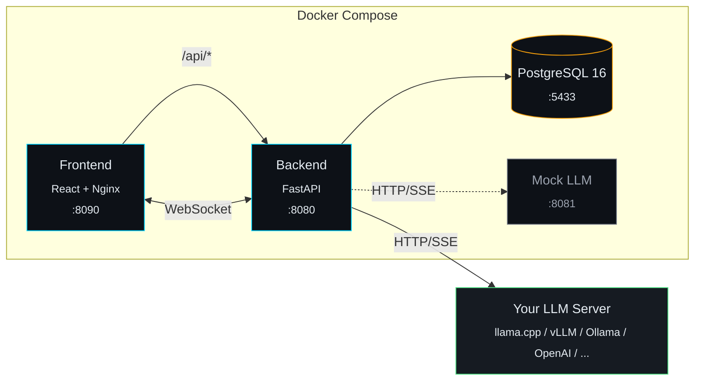

<div align="center">

# LM Lens

**Realistic multi-user LLM benchmarking for any OpenAI-compatible endpoint**

[](LICENSE)
[](docker-compose.yml)
[](backend/)
[](frontend/)
[](backend/)
[](docker-compose.yml)

Most LLM benchmarks fire uniform requests in a loop. Real users don't behave like that.

LM Lens simulates **diverse user archetypes** — casual chatters, researchers writing long analytical prompts, programmers pasting code blocks, data analysts querying tables — each with realistic conversation patterns, think times, and multi-turn sessions. Point it at any OpenAI-compatible API and find out how your inference server actually performs under realistic load.

</div>

---

<!-- 
  SCREENSHOTS: Drop your images in docs/images/ and uncomment these sections.
  Recommended captures:
    1. dashboard.png    — Dashboard overview with fleet metrics and charts
    2. live-run.png     — Active benchmark with live TTFT timeline and throughput
    3. analysis.png     — Analysis tab showing prefill/decode token economy chart
-->

<!--
<div align="center">
  
  <br><br>
  
  <br><br>
  
</div>

---
-->

## Why LM Lens?

You just deployed a model on your shiny new GPU. The single-user latency looks great. But what happens when 20 users hit it at once — some pasting 2K-token code blocks while others fire off quick one-liners?

LM Lens answers that question. It models the **workload mix**, not just the request count.

## Features

<table>
<tr>
<td width="50%">

**Workload Simulation**
- 4 built-in user profiles with distinct prompt patterns
- Multi-turn conversations with variable substitution
- Realistic think time and read time between turns
- Create custom profiles for your specific workloads

</td>
<td width="50%">

**Test Modes**
- **Stress Test** — full concurrent load for a set duration
- **Ramp Up** — gradually add users (step, linear, spike, wave curves)
- **Breaking Point** — auto-detect failure thresholds for TTFT, ITL, or error rate

</td>
</tr>
<tr>
<td>

**Live Dashboard**
- Real-time WebSocket metrics with 1s resolution
- TTFT timeline (P50/P95), throughput, error rate charts
- Per-profile latency breakdown
- Live request log with auto-scroll
- Countdown timer and progress tracking

</td>
<td>

**Prefill / Decode Analysis**
- Token economy chart with three views: Tokens, Time, Speed
- See GPU time split between prefill and decode per profile
- Identify whether your workload is compute-bound or memory-bandwidth-bound
- Prefill tok/s vs decode tok/s comparison

</td>
</tr>
<tr>
<td>

**Quality Scoring**
- Heuristic evaluation: completeness, compliance, coherence, safety
- Per-response quality flags (truncated, empty, refusal, repeated)
- Quality-under-load correlation charts
- N-gram repetition detection

</td>
<td>

**Comparison & Export**
- A/B benchmark comparison with delta percentages
- Response browser with chat-style conversation viewer
- Per-turn ITL sparklines and quality flag pills
- CSV and JSON export

</td>
</tr>
</table>

## Quick Start

### Prerequisites

- [Docker](https://docs.docker.com/get-docker/) and Docker Compose

### 1. Clone and configure

```bash
git clone https://github.com/RunningOnCoffee/lm-lens.git
cd lm-lens
cp .env.example .env
```

### 2. Start all services

```bash
docker compose up --build -d
```

This starts the database, backend (with auto-migrations and seed data), frontend, and a mock LLM server for testing.

### 3. Open the UI

```
http://localhost:8090
```

### 4. Run your first benchmark

1. **AI Endpoints** — Add your LLM server, or use the built-in mock at `http://lm-lens-mock:8000`
2. **Scenarios** — Pick user profiles, set user counts, choose a test mode
3. **Benchmarks** — Select scenario + endpoint, hit **Start**, watch the live dashboard

## Connecting to LLM Endpoints

Requests are made from inside Docker. Use these URLs depending on where your LLM runs:

| LLM Location | Endpoint URL |
|---|---|
| Built-in mock server | `http://lm-lens-mock:8000` |
| Local LLM on host (llama.cpp, vLLM, Ollama, LM Studio) | `http://host.docker.internal:PORT` |
| Remote machine on network | `http://<MACHINE_IP>:PORT` |
| Cloud API (OpenAI, Together, etc.) | `https://api.openai.com` (+ API key) |

The `/v1/chat/completions` path is appended automatically. Use **Test Connection** in the UI to verify.

## Architecture



## Metrics Collected

| Metric | Description |
|--------|-------------|
| **TTFT** | Time to First Token — prefill/prompt processing latency |
| **TGT** | Total Generation Time — end-to-end request duration |
| **ITL** | Inter-Token Latency — time between consecutive tokens |
| **tok/s** | Tokens per second — generation throughput |
| **Prefill Speed** | Input tokens processed per second (tok/s during TTFT) |
| **Decode Speed** | Output tokens generated per second (tok/s during decode) |
| **Quality Scores** | Per-dimension: completeness, compliance, coherence, safety |
| **Quality Flags** | Truncated, empty, refusal, repeated tokens — per response |

## User Profiles

LM Lens ships with 4 built-in profiles that model distinct usage patterns:

| Profile | Prompt Style | Turns | Use Case |
|---------|-------------|-------|----------|
| **Casual User** | Short conversational prompts | 1-3 | Chat, quick questions |
| **Power User** | Long analytical prompts | 5-15 | Research, deep analysis |
| **Programmer** | Code blocks, debugging, multi-turn refinement | 3-8 | Development workflows |
| **Data Analyst** | CSV/table data, SQL generation | 2-6 | Data pipelines |

Create custom profiles to match your specific user base.

## Development

```bash
# Rebuild and restart
docker compose up --build -d

# Tail logs
docker compose logs -f

# Run backend tests (133 passing)
docker compose exec lm-lens-api pytest -v

# Database shell
docker compose exec lm-lens-db psql -U lm-lens -d lm-lens

# Full reset (destroys all data)
docker compose down -v && docker compose up --build -d
```

## Tech Stack

| Layer | Technologies |
|-------|-------------|
| **Backend** | Python 3.12, FastAPI, SQLAlchemy 2.0 (async), Alembic, httpx, asyncpg, Pydantic v2 |
| **Frontend** | React 18, Vite 5, Tailwind CSS 3, Recharts, Zustand, React Router v6 |
| **Database** | PostgreSQL 16 |
| **Infrastructure** | Docker Compose, Nginx reverse proxy |

## License

[MIT](LICENSE) - Bruno Maddaloni
